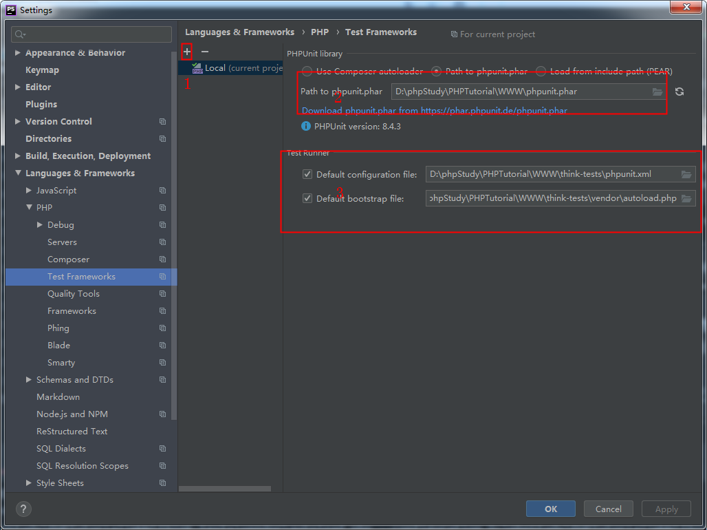
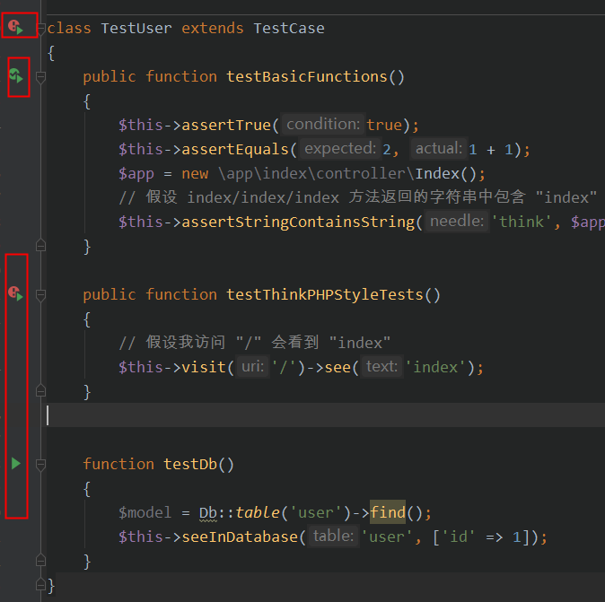

# ThinkPHP 5.1 集成 PHPUnit 8 测试框架

**本项目仅适用于运行 PHP7.2 以上的环境！对于低版本 PHP 请根据需要调整 PHPUnit 的版本！**
## 声明

由于原项目 [think-testing](https://github.com/top-think/think-testing) 长久不更新导致无法兼容最新版本的PHP和PHpstrom,无法像java一样进行单元调试。所以在此改造一番。PHPUnit基础请参考[PHPUnit](https://blog.csdn.net/agonie201218/article/details/89675236) 

### 版本号参考

| PHP 版本                                         | PHPUnit 版本 |
| ------------------------------------------------ | ------------ |
| 7.3, 7.2                                         | 8            |
| 7.1 （仅安全更新，2019 年 12 月 1 日起停止支持） | 7            |
| 7.0 （已经停止支持）                             | 6            |
| 5.6 （已经停止支持）                             | 5            |
| 5.5, 5.4, 5.3 （已经停止支持）                   | 4            |

## 教程

1. 首先你要学会使用 [Composer](https://getcomposer.org/download/)，可以参考 [laravel-china](https://learnku.com/composer/t/4484/composer-mirror-use-help) 的这篇教程，里面包含了从安装 Composer 开始到配置国内镜像加速源全套流程，速度不佳还可以尝试使用 [Packagist / Composer 中国全量镜像（含安装教程）](https://pkg.phpcomposer.com/) 或者 [阿里云 Composer 全量镜像](http://mirrors.aliyun.com/composer/)。请尽可能使用比较新的 Composer 版本！截止我写这篇文章时，我的 Composer 版本号是 `Composer version 1.8.6 2019-06-11 15:03:05`（使用 `composer --version` 查看）

2. 在自己的项目下安装 PHPUnit 扩展和必要的 `symfony/dom-crawler` 扩展，以及使用的 think-testing 包中会用到的 `topthink/think-helper`，参考命令：

   ```bash
   $ composer require phpunit/phpunit=^8 --dev
   $ composer require symfony/dom-crawler=^2.8.8 --dev
   $ composer require topthink/think-helper
   ```

   请注意安装的版本号，再次强调：

   **PHPUnit 的版本号要和 PHP 的版本相对应！并不是越高越好！ ** 具体的版本号请参考开头的表格，把 `=^8` 替换成对应的数字即可。

    `symfony/dom-crawler` 扩展之所以使用 2.8.8~3.0 以前版本主要是为了模拟原 [think-testing](https://github.com/top-think/think-testing) 项目中模拟爬取网页 DOM 节点部分所使用的包，因为我的开发不涉及页面部分故高版本未作测试。

   ` topthink/think-helper` 扩展会自动根据你当前的 ThinkPHP 主框架版本确定，所以无需指定版本号。

3. 在自己的项目根目录下创建 `tests` 文件夹，修改 `composer.json` 文件的 `"autoload"` 部分：在 `"psr-4"`后面的列表中添加：

   ```json
   "tests\\": "tests",
   "think\\": "thinkphp/library/think",
   "traits\\": "thinkphp/library/traits"
   ```

   添加完成的 `"autoload"` 部分应该长这样：

   ```json
   "autoload": {
       "psr-4": {
           "app\\": "application",
           "tests\\": "tests",
           "think\\": "thinkphp/library/think",
           "traits\\": "thinkphp/library/traits"
       }
   }
   ```

   完成后在项目根目录执行 `composer update` 生成 autoload 文件

4. 在任意位置新建文件夹并进入，在新建的这个文件夹里使用 `composer require topthink/think-testing` 安装官方的 [think-testing](https://github.com/top-think/think-testing) 项目，拷贝 `vendor/topthink/think-testing/src/` 目录下除 `config.php` 文件和 `command` 文件夹外所有文件到自己的项目根目录下的 `tests` 文件夹中，修改所有文件的 `namespace` 命名空间为 `tests`。

5. 在你的项目根目录创建名为 `phpunit.xml` 的文件，用于指定自动测试，内容如下：

   ```xml
   <?xml version="1.0" encoding="UTF-8"?>
   <phpunit backupGlobals="false"
            backupStaticAttributes="false"
            colors="true"
            convertErrorsToExceptions="true"
            convertNoticesToExceptions="true"
            convertWarningsToExceptions="true"
            processIsolation="false"
            stopOnFailure="false">
       <testsuites>
           <testsuite name="Application Test Suite">
               <directory suffix=".php">./tests/</directory>
           </testsuite>
       </testsuites>
       <filter>
           <whitelist>
               <directory suffix=".php">application/</directory>
           </whitelist>
       </filter>
   </phpunit>
   ```

6. 在 `tests/TestCase.php` 文件中添加 `__construct` 方法如下：

   ```php
   public function __construct(?string $name = null, array $data = [], string $dataName = '') {
       // 引入需要的环境
       require_once __DIR__ . '/../thinkphp/base.php';
       // 初始化 App 对象，并将 APP_PATH 指向项目的 application 目录
       App::getInstance()->path(__DIR__ . '/../application/')->initialize();
   
       parent::__construct($name, $data, $dataName);
   }
   ```

7. 在 `tests/TestCase.php` 文件中添加 `$baseUrl` 的成员变量如下：

   ```php
   protected $baseUrl = '';
   ```

   **注意：如果开启了强制路由的选项，那这里要和你路由中配置的域名一致** ，如果不一致会报莫名其妙的 500 错误。

8. 从根目录下运行 `./vendor/bin/phpunit` 测试单元测试是否配置成功，如果出来的结果是类似于：

   ```bash
   $ ./vendor/bin/phpunit 
   PHPUnit 8.2.4 by Sebastian Bergmann and contributors.
   
   Time: 6 ms, Memory: 2.00 MB
   
   No tests executed!
   ```

   那么恭喜你，环境是没啥问题了。

9. 最后一步，编写一个简单的测试，在 `tests` 文件夹中创建名为 `BasicTest.php` 的测试文件，内容如下：

   ```php
   <?php
   namespace tests;
   
   class BasicTest extends \tests\TestCase {
       public function testBasicFunctions() {
           $this->assertTrue(true);
           $this->assertEquals(2, 1+1);
           $app = new \app\index\controller\Index();
           // 假设 index/index/index 方法返回的字符串中包含 "index"
           $this->assertStringContainsString('index', $app->index());
       }
   
       public function testThinkPHPStyleTests() {
           // 假设我访问 "/" 会看到 "index"
           $this->visit('/')->see('index');
       }
   }
   ```

   从根目录下运行 `./vendor/bin/phpunit` ，如果出来的结果是类似于：

   ```bash
   $ ./vendor/bin/phpunit 
   PHPUnit 8.2.4 by Sebastian Bergmann and contributors.
   
   ..                                                                  2 / 2 (100%)
   
   Time: 26 ms, Memory: 6.00 MB
   
   OK (2 tests, 5 assertions)
   ```

   恭喜你，大功告成，你接下来就可以按照网上的 PHPUnit 的教程开始编写测试了。在我的测试环境下（OSX 10.13, Homebrew PHP 7.2, PHPUnit 8），所有的测试，只要是放到 `tests` 文件夹下且保持命名空间正确就可以自动测试，按照需要测试的类首字母顺序进行。

## 常见问题

1. 错误：xxx Not Found

   一般是之前 `composer require` 的部分没有装好，回去重新执行即可。

2. 测试结果提示：

   ```bash
   OK, but incomplete, skipped, or risky tests!
   Tests: 4, Assertions: 10, Risky: 1.
   ```

   或者是红字：

   ```bash
   FAILURES!
   Tests: 5, Assertions: 10, Failures: 1.
   ```

   请参考 PHPUnit 相关资料，第一个可能是因为有测试里面什么都没执行，第二个是因为有测试失败了

3. 完全不能执行，提示错误：

   ```bash
   include(): Filename cannot be empty
   ```

    或者

   ```bash
   think\exception\ErrorException: include(): Filename cannot be empty
   ```

   之前 `__construct` 那一步没做好，或者是 `base.php` 没引对，或者是 APP_PATH 配置错了

4. 错误：

   ```
   A request to xxx failed. Received status code 500.
   ```

   恭喜，最难搞的错误之一。原因很多，但是不明确，可能是使用了高版本的 PHP 搭配了低版本的 PHPUnit：比如 PHP 7.2 中的 each() 函数已经 deprecated 了，但是 PHPUnit 6 中仍有使用（也是造成我默认项目测试不了的原因）；也可能是强制路由模式下路由配置不正确，没有命中任何路由；也有可能是因为 `$baseUrl` 或者其他域名相关的配置不正确导致的。可以创建空项目进行尝试，如果空项目正常说明是原来项目配置有问题或者路由不对。

5. 提示：

   ```bash
   PHP Fatal error:  Class tests\HttpException may not inherit from final class (PHPUnit\Framework\ExpectationFailedException) in /path/to/your/project/tests/HttpException.php on line 7
   ```

   修改 InteractWithPages.php 第 484 行为：

   ```php
   throw new \PHPUnit\Framework\ExpectationFailedException($message);
   ```

   并删除 `tests/HttpException.php` 文件
   
## 在PhpStorm 中使用单元调试
### 1. 配置PhpStorm
1.配置phpunit.phar路径
2.配置phpunit.xml路径
3.配置启动文件路径
 
### 2.点击run
 
### 3.结果
 